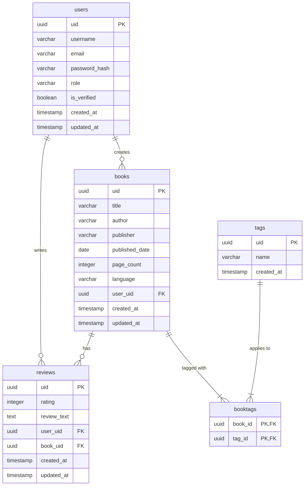

# 📚 Booksly API — Corestack Backend

[](https://fastapi.tiangolo.com/)
[](https://www.postgresql.org/)
[](https://redis.io/)
[](https://sqlmodel.tiangolo.com/)
[](https://www.python.org/)
[](https://opensource.org/licenses/MIT)

A production-grade, asynchronous RESTful backend built with **FastAPI** and **SQLModel** for a book review web service. 

This repository implements industry-standard backend patterns including asynchronous database operations, secure token authentication with dual-token validation, token blocklisting, custom global exceptions, and role-based access control (RBAC).

---

## ⚡ Key Architectural Features

- **Asynchronous Stack**: Built completely on FastAPI, `asyncpg`, and `SQLModel` for high-concurrency database communications.
- **Robust Authentication**: Custom JWT authentication utilizing **Access Tokens** (short-lived) and **Refresh Tokens** (long-lived) generated via `pwdlib` (recommended hashing) and `pyjwt`.
- **Token Revocation (Blocklist)**: Instant logout capabilities supported by **Redis** as a caching database to store and verify revoked Token Identifiers (`jti`).
- **Role-Based Access Control (RBAC)**: Secure, extensible dependency-driven authorization checking paths (e.g. `admin`, `user`).
- **Custom Global Exception Handler**: Comprehensive, localized error management converting Python exceptions into uniform API error payloads.
- **Automated Database Migrations**: Seamless schema tracking via **Alembic** mapped with `SQLModel` metadata.
- **Clean Unit Testing**: Structured testing with `pytest` utilizing fixtures and mocks.

---

## 📐 Architecture & Flow

The project follows a modular, layer-separated structure focusing on separation of concerns:
```
Client Request
     │
     ▼
┌──────────────────────────────────────────────┐
│                  FastAPI                     │
│  (Routers, Middleware, CORS, Exception Hand) │
└────────┬───────────────────────────────┬─────┘
         │                               │
         ▼ (Dependencies)                │
┌───────────────────────────┐            │
│  Auth & RBAC Guardians    │            │
│  - AccessTokenBearer      │            │
│  - RefreshTokenBearer     │            │
│  - RoleChecker            │            │
└────────┬──────────────────┘            │
         │ (Token Blocklist Check)       │
         ▼                               ▼
┌──────────────────┐           ┌──────────────────┐
│   Redis Cache    │           │   API Routers    │
│ (Blocklisted JTI)│           │ (Auth, Books,    │
└──────────────────┘           │  Reviews, Tags)  │
                               └────────┬─────────┘
                                        │
                                        ▼
                               ┌──────────────────┐
                               │ Business Logic   │
                               │   (Services)     │
                               └────────┬─────────┘
                                        │
                                        ▼ (Async Session)
                               ┌──────────────────┐
                               │    SQLModel      │
                               │  (ORM/Metadata)  │
                               └────────┬─────────┘
                                        │
                                        ▼
                               ┌──────────────────┐
                               │  PostgreSQL DB   │
                               └──────────────────┘
```

---

## 📊 Database Schema (ER Diagram)

Below is the database entity-relationship schema designed for Booksly. Relationships are fully asynchronous and pre-configured to utilize SQLModel `selectin` loading to avoid `N+1` query issues:



---

## 📁 Project Structure

```directory
SSALI/
├── src/
│   ├── __init__.py          # FastAPI Application initialization & router imports
│   ├── config.py            # Environment configuration settings (Pydantic Settings)
│   ├── errors.py            # Global custom exceptions and API handlers
│   ├── auth/                # Authentication module
│   │   ├── dependencies.py  # JWT & RBAC dependency injection guards
│   │   ├── routes.py        # Registration, Login, Token Refresh and Logout API endpoints
│   │   ├── schemas.py       # Pydantic data schemas
│   │   ├── service.py       # User CRUD database operations
│   │   └── utils.py         # JWT generation/decoding & password hashing helpers
│   ├── books/               # Books management module (CRUD)
│   │   ├── routes.py
│   │   ├── schemas.py
│   │   └── service.py
│   ├── db/                  # Database management layer
│   │   ├── main.py          # SQLAlchemy async engine & session configurations
│   │   ├── models.py        # Centralized SQLModel entity schemas
│   │   └── redis.py         # Redis client configuration & token blocklist helpers
│   ├── reviews/             # Book reviews management module
│   │   ├── routes.py
│   │   ├── schemas.py
│   │   └── service.py
│   ├── tags/                # Book tagging categorization module
│   │   ├── routes.py
│   │   ├── schemas.py
│   │   └── service.py
│   └── test/                # Test suite directory
│       ├── conftest.py      # Pytest shared fixtures
│       └── auth/            # Auth and RBAC tests
├── migrations/              # Alembic schema migrations control scripts
├── alembic.ini              # Database migration configuration file
├── requirements.txt         # Project dependencies
└── venv/                    # Virtual Environment
```

---

## ⚙️ Setup and Configuration

### Prerequisites
Ensure you have the following installed:
- Python 3.10+
- PostgreSQL
- Redis Server

### 1. Clone & Navigate
```bash
git clone https://github.com/Chinmay-Jadhav/corestack-backend.git
cd corestack-backend
```

### 2. Virtual Environment Setup
```bash
# Create virtual environment
python -m venv venv

# Activate on Windows:
venv\Scripts\activate

# Activate on Linux/MacOS:
source venv/bin/activate
```

### 3. Install Dependencies
```bash
pip install -r requirements.txt
```

### 4. Configure Environment Variables
Create a `.env` file in the root directory:
```env
DATABASE_URL=postgresql+asyncpg://<username>:<password>@localhost:<port>/<dbname>
JWT_SECRET=your_jwt_hexadecimal_secret_key
JWT_ALGO=HS256
REDIS_HOST=localhost
REDIS_PORT=6379
```

### 5. Run Database Migrations
Initialize and structure the PostgreSQL tables using Alembic:
```bash
alembic upgrade head
```

### 6. Start the Application
Run the FastAPI development server:
```bash
uvicorn src:app --reload
```
Once started, the API endpoints and interactive documentation are available at:
- **Swagger UI**: [http://localhost:8000/docs](http://localhost:8000/docs)
- **ReDoc**: [http://localhost:8000/redoc](http://localhost:8000/redoc)

---

## 🔐 Authentication & Session Flow

The project implements a state-of-the-art dual-token JWT pipeline:

1. **User Sign Up & Login**:
   - Client sends credentials to `POST /api/v1/auth/login`.
   - On verification, server returns an `access_token` (expires in 1 hr) and a `refresh_token` (expires in 2 days).
2. **Accessing Protected Resources**:
   - Clients send requests containing the header: `Authorization: Bearer <access_token>`.
   - The token is parsed. Its unique identifier (`jti`) is checked against the **Redis Blocklist**. If blocked or expired, the request is rejected with `401 Unauthorized`.
3. **Session Refreshing**:
   - Before the `access_token` expires, clients send a request to `GET /api/v1/auth/refresh_token` using their `refresh_token` in the authorization header.
   - The server validates the token and issues a brand-new short-lived `access_token`.
4. **Log Out**:
   - The client invokes `GET /api/v1/auth/logout` presenting the `access_token`.
   - The server extracts the token's `jti` and registers it inside Redis with an expiration matching the token's remaining time. Any future request using this token fails immediately.

---

## 🛠 API Catalog

| Module | Endpoint | Method | Access Level | Description |
| :--- | :--- | :--- | :--- | :--- |
| **Authentication** | `/api/v1/auth/signup` | `POST` | Public | Register a new user account |
| | `/api/v1/auth/login` | `POST` | Public | Authenticate user & generate JWT tokens |
| | `/api/v1/auth/refresh_token`| `GET` | User / Admin | Refresh expired access tokens using a refresh token |
| | `/api/v1/auth/me` | `GET` | User / Admin | Get current authenticated user details and submitted books |
| | `/api/v1/auth/logout` | `GET` | User / Admin | Revoke access token and add JTI to Redis blocklist |
| **Books** | `/api/v1/books/` | `GET` | User / Admin | Retrieve all books (most recent first) |
| | `/api/v1/books/` | `POST` | User / Admin | Add a new book (relates to the current user) |
| | `/api/v1/books/{book_uid}` | `GET` | User / Admin | Fetch details of a single book with tags and reviews |
| | `/api/v1/books/{book_uid}` | `PATCH`| User / Admin | Update book parameters |
| | `/api/v1/books/{book_uid}` | `DELETE`| User / Admin | Remove book from catalog |
| | `/api/v1/books/user/{user_uid}`| `GET` | User / Admin | Get all books submitted by a specific user |
| **Reviews** | `/api/v1/reviews/` | `GET` | Admin | Retrieve all reviews (ordered by date) |
| | `/api/v1/reviews/book/{book_uid}`| `POST`| User / Admin | Add a star rating review to a specific book |
| | `/api/v1/reviews/{review_uid}` | `DELETE`| User / Admin | Delete user-submitted book review |
| **Tags** | `/api/v1/tags/` | `GET` | User / Admin | Get all tags list |
| | `/api/v1/tags/` | `POST` | User / Admin | Create a new custom tag |
| | `/api/v1/tags/book/{book_uid}/tags`| `POST`| User / Admin | Apply tag array to a book (sets M2M relations) |
| | `/api/v1/tags/{tag_uid}` | `PUT` | User / Admin | Update tag label |
| | `/api/v1/tags/{tag_uid}` | `DELETE`| User / Admin | Delete tag |

---

## 🧪 Running Tests

The test suite validates password hashing logic, JWT token creation, and Role-Based Access Control logic using `pytest`.

```bash
# Run all tests
pytest

# Run tests with detailed console output
pytest -v
```
